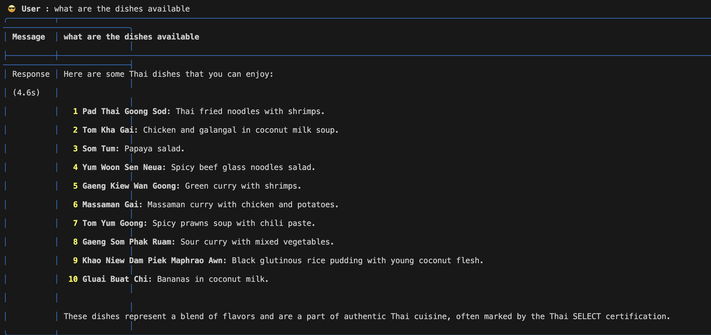

# Day 2 - Thai Recipes: PDF Assistant

In this tutorial, we learn how to use agentic AI in RAG applications. We are going to build Thai Recipe agentic AI RAG application which will generate text that is relevant to ThaiRecipes that we provided for the question asked.

## Code Explanation
This code sets up a **CLI-based assistant** using various tools and frameworks to interact with a knowledge base built from a PDF document. Below is a breakdown of its functionalities:

---

## **Key Functionalities**

1. **Environment Setup**:
   - Loads environment variables from a `.env` file using `dotenv`.
   - Sets the `GROQ_API_KEY` for Groq API access.

2. **Database Configuration**:
   - Use docker command below to setup postgreSQL DB in your machine. 
   ``` bash
      docker run -d \
      -e POSTGRES_DB=ai \
      -e POSTGRES_USER=ai \
      -e POSTGRES_PASSWORD=ai \
      -e PGDATA=/var/lib/postgresql/data/pgdata \
      -v pgvolume:/var/lib/postgresql/data \
      -p 5532:5432 \
      --name pgvector \
      phidata/pgvector:16
   ```


   - Configures a PostgreSQL database URL (`db_url`) for storing assistant and vector data.

3. **Knowledge Base**:
   - Uses `PDFUrlKnowledgeBase` to load and vectorize the contents of a PDF file (`ThaiRecipes.pdf`).
   - Leverages **PgVector2** for vector-based storage and retrieval of document embeddings from a PostgreSQL database.

4. **Assistant Storage**:
   - Utilizes `PgAssistantStorage` to store and retrieve assistant session data in the `pdf_assistant` table.

5. **Assistant Initialization**:
   - Sets up an `Assistant` instance with the following capabilities:
     - Search the knowledge base for relevant information.
     - Save and recall chat history.
     - Display tool calls during interaction.

6. **CLI Application**:
   - Integrates with `typer` to provide a command-line interface (CLI) for interacting with the assistant.
   - Allows the user to start a **new session** or continue an **existing session** based on the `user` ID.


---

## **Code Execution**

- **When Run**:
  - The script initializes or resumes an assistant session, prints the session details, and launches a CLI application for user interaction.
  - Commands and outputs are displayed in **Markdown format** within the CLI.

---

## **Usage**

- **Launch Command**:
  ```bash
  python pdf_assistant.py

For this example, we are using documentation (https://docs.phidata.com/vectordb/pgvector) and YouTube video tutorial.


## Results
### Screenshot 1
Prompt: what are the dishes available



### Screenshot 2
Prompt: what are the ingredients of Gluai Buat Chi

